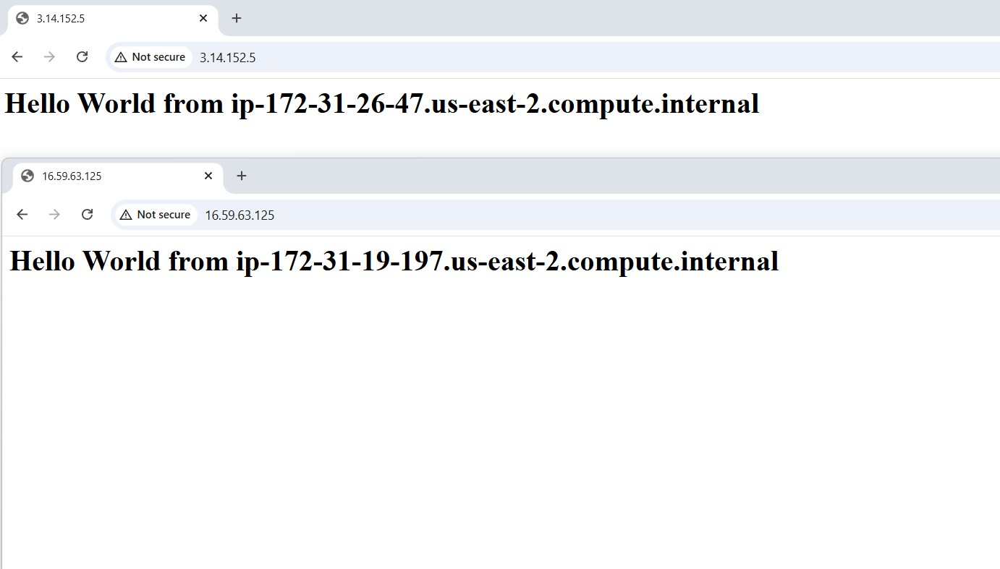
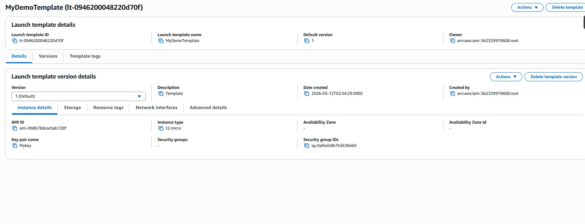
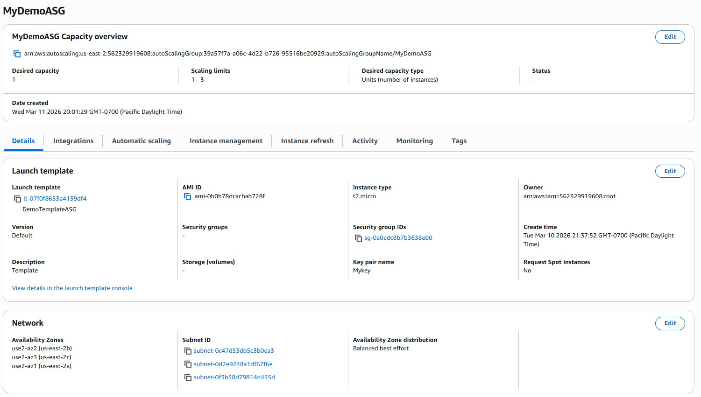
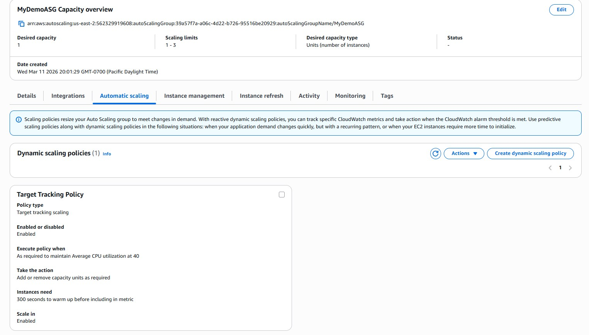
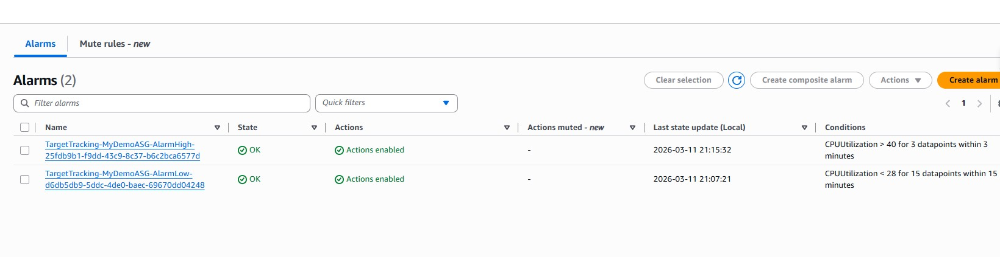
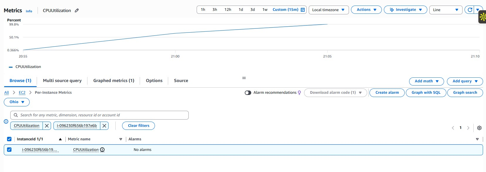
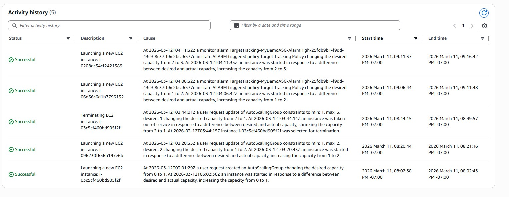
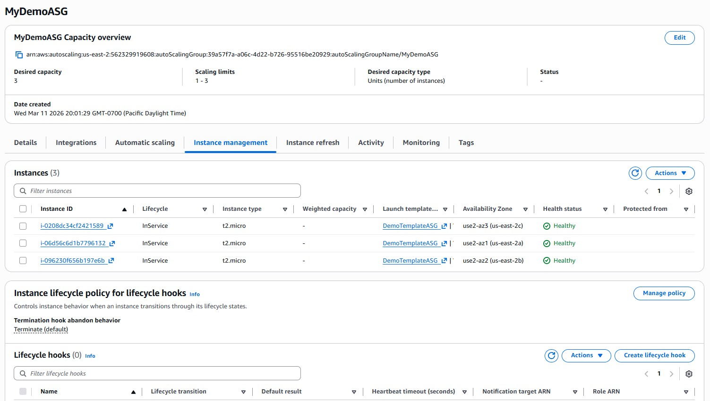

# AWS ALB + Auto Scaling Demo

This project demonstrates a highly available AWS web architecture using:

- EC2 instances
- Application Load Balancer (ALB)
- Target Groups
- Auto Scaling Groups
- CloudWatch dynamic scaling

The architecture distributes traffic across EC2 instances and automatically scales based on CPU utilization.

---

## EC2 Instances Running

---

## Two Web Servers Running Without ALB

---

## Target Group Configuration

---

## Target Group Healthy Instances

---

## Application Load Balancer Configuration

---

## Load Balancing Demonstration

---

## Instance Failure Simulation

---

## Target Group After Instance Stop

---

## Traffic Redirected to Healthy Instance

---

## Launch Template Configuration

---

## Auto Scaling Group Configuration

---

## Dynamic Scaling Policy

---

## CloudWatch CPU Alarm

---

## CPU Utilization Spike

---

## Auto Scaling Scale Out Activity

---

## New Instance Launched

---

## Key Learnings

- Application Load Balancer distributes traffic across EC2 instances.
- Target group health checks ensure only healthy instances receive traffic.
- Auto Scaling maintains system availability.
- CloudWatch alarms trigger dynamic scaling based on CPU utilization.
