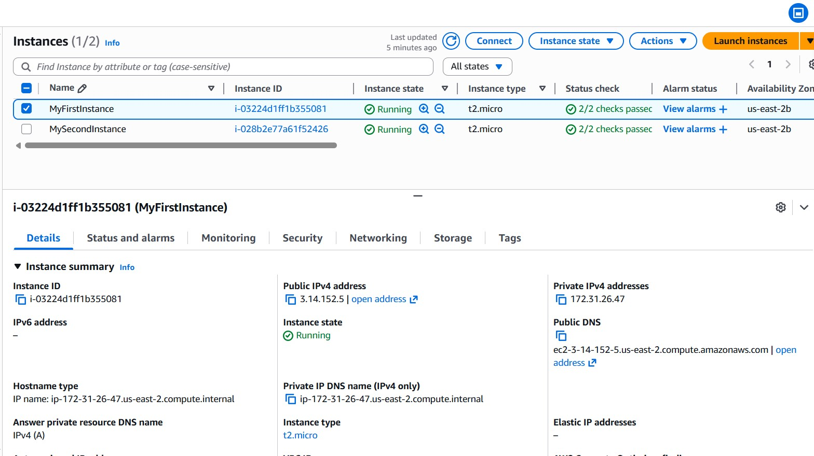
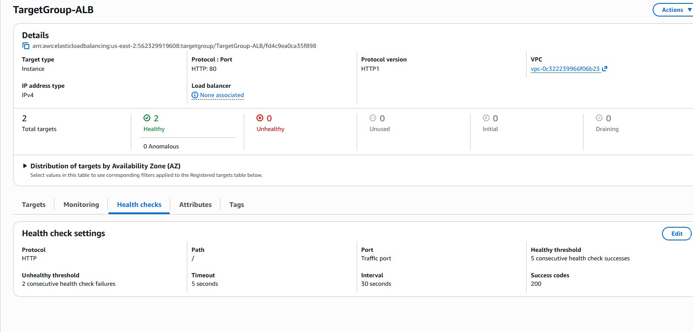
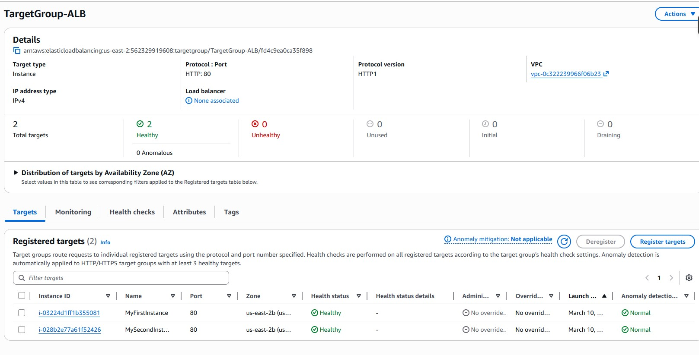
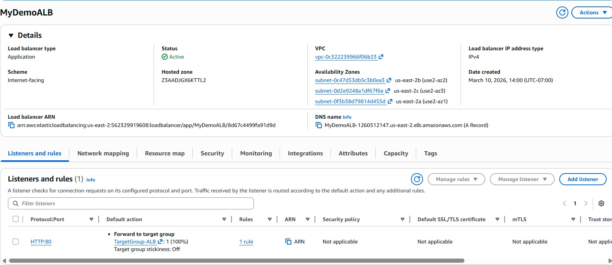
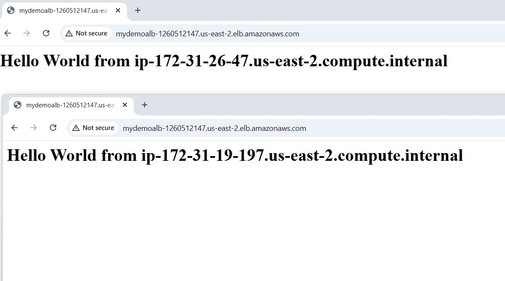
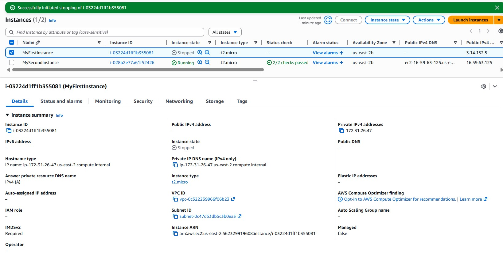
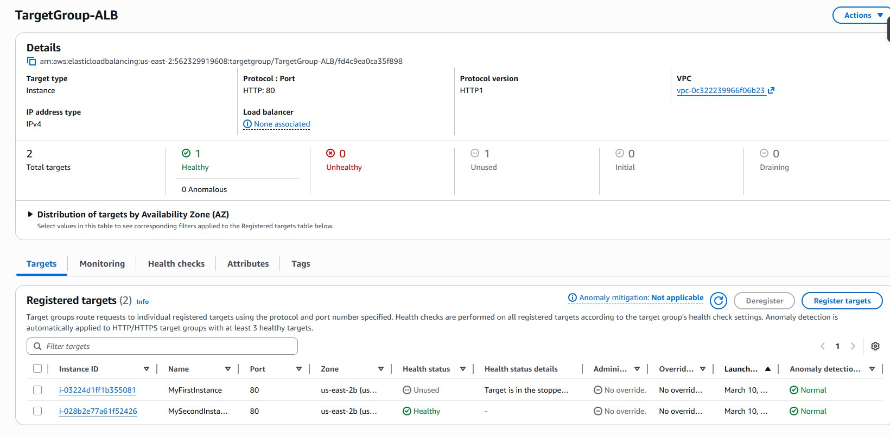
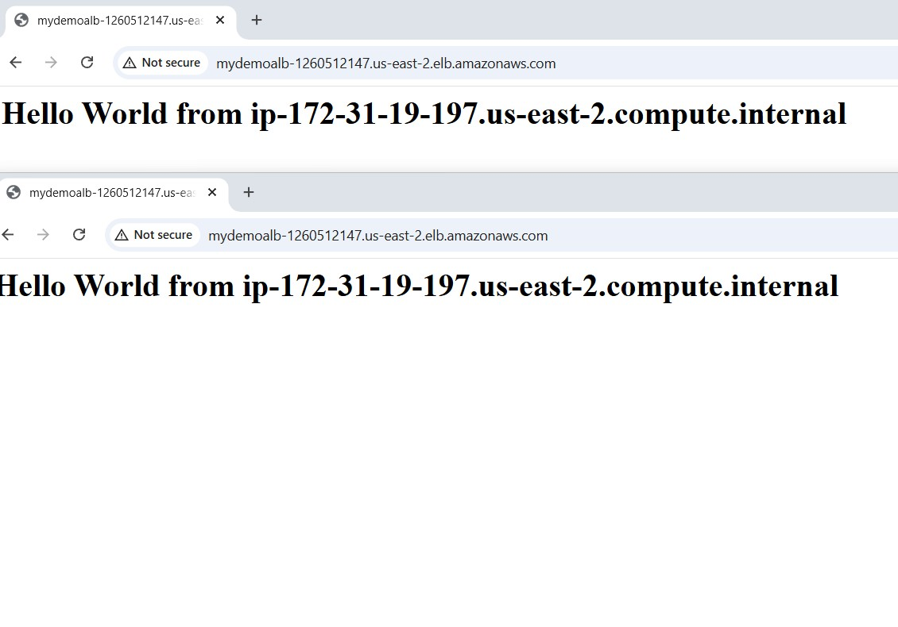

# aws-alb-autoscaling-demo
AWS High Availability Architecture using ALB, EC2 and Auto Scaling with failure testing
# AWS ALB + EC2 + Auto Scaling Demo

This project demonstrates a highly available web architecture using:

- Amazon EC2
- Application Load Balancer (ALB)
- Target Groups
- Health Checks
- Failure Simulation

The architecture distributes traffic across multiple instances and automatically redirects traffic when a server fails.

---

## EC2 Instances Running

---

## Two Web Servers Running Without Load Balancer

Each EC2 instance serves its own webpage.

---

## Target Group Configuration

Target group created to register EC2 instances and perform health checks.

---

## Target Group Healthy Instances

Both instances are registered and healthy.

---

## Application Load Balancer Configuration

Application Load Balancer created to distribute traffic.

---

## Load Balancing Demonstration

Traffic is distributed between both EC2 instances.

Refreshing the page alternates between Server 1 and Server 2.

---

## Failure Simulation

One EC2 instance was stopped to simulate server failure.

---

## Target Group After Instance Stop

The stopped instance is no longer used for routing.

---

## Traffic Redirected to Healthy Server

All traffic is automatically routed to the remaining healthy instance.

---

## Key Learnings

- Load balancers distribute traffic across servers
- Health checks detect unhealthy instances
- Fault tolerance ensures service availability
- Traffic automatically redirects during failures

---

## Technologies Used

- AWS EC2
- Application Load Balancer
- Target Groups
- Auto Scaling
